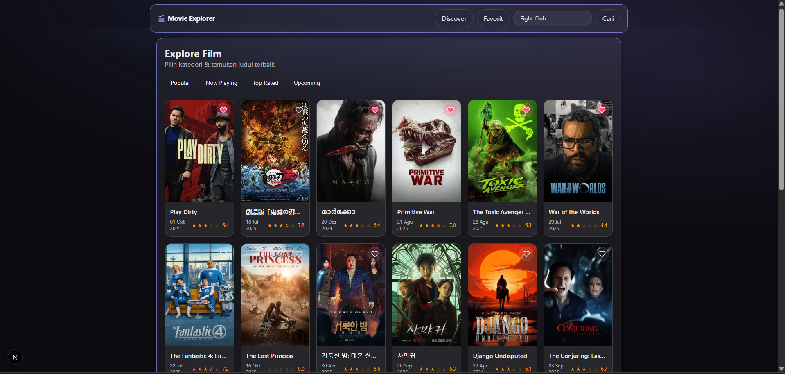
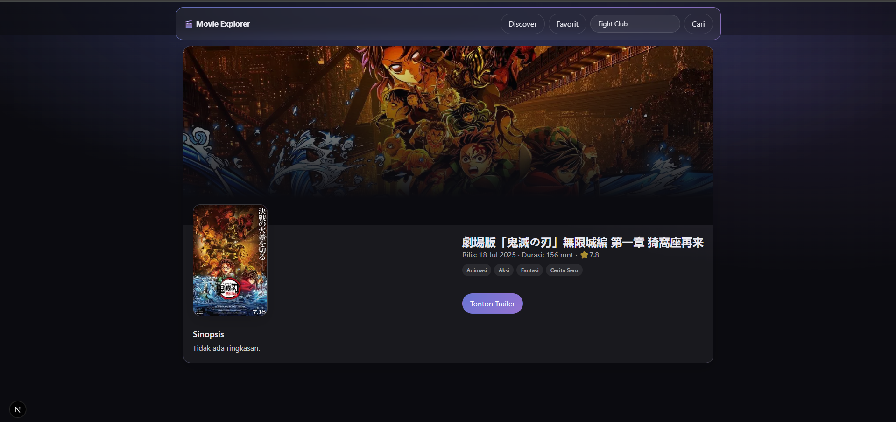

# 🎬 Movie Explorer — Next.js 15 + Tailwind v4

Aplikasi eksplorasi film berbasis **TMDB** dengan UI modern: kategori, pencarian, detail dengan trailer YouTube, **favorites** (localStorage), dan **discover by genre**. Dibangun dengan **Next.js 15 (App Router)** + **Tailwind CSS v4**.

## ✨ Fitur

- **Home**: kategori *Popular / Now Playing / Top Rated / Upcoming* dengan pagination.
- **Search**: form GET → `/search?query=...` (progressive enhancement).
- **Detail Film**: backdrop sinematik, genre chips, rating, dan **Trailer modal (YouTube)**  
  ↳ Trailer otomatis **fallback**: `id-ID` → `en-US` → default bila tidak tersedia.
- **Favorites / Watchlist**: simpan ID film ke **localStorage** (ikon hati) + halaman **/favorites** (batched fetch via API).
- **Discover by Genre**: halaman **/discover** dengan filter genre (toggle chips) + pagination.
- **UI Modern**: glass, gradient border, spotlight hover, skeleton shimmer, tombol “pill”.
- **Performa**: Next Image, ISR (revalidate), server components.
- **Aksesibilitas**: modal trailer dengan `role="dialog"`, Escape-to-close.

---

## 🧱 Teknologi

- **Next.js 15** (App Router)
- **Tailwind CSS v4**
- **TypeScript**
- **TMDB API (v3)**

---

## 🖼️ Screenshot




---

## 🚀 Menjalankan Secara Lokal

### Prasyarat
- **Node.js 20+**
- **TMDB API Key (v3)** — daftar gratis: https://www.themoviedb.org/

### Setup
```bash
# 1) install dependencies
npm install

# 2) buat file environment
cp .env.local.example .env.local   # jika tidak ada, buat manual
```

**`.env.local`**
```env
TMDB_API_KEY=ISI_API_KEY_TMDB_ANDA
TMDB_API_LANG=id-ID
```

> Semua request ke TMDB dilakukan di **Server Components / Route Handlers** agar API key aman (tidak diekspos ke browser).

### Jalankan
```bash
npm run dev
# buka http://localhost:3000
```

## ⚙️ Script NPM

```bash
npm run dev      # dev server
npm run build    # production build
npm run start    # start prod server (setelah build)
```

## 🙏 Kredit

- Data & poster oleh **[TMDB](https://www.themoviedb.org/)**.  
  Aplikasi ini menggunakan API TMDB namun tidak disponsori/berafiliasi resmi.

---
